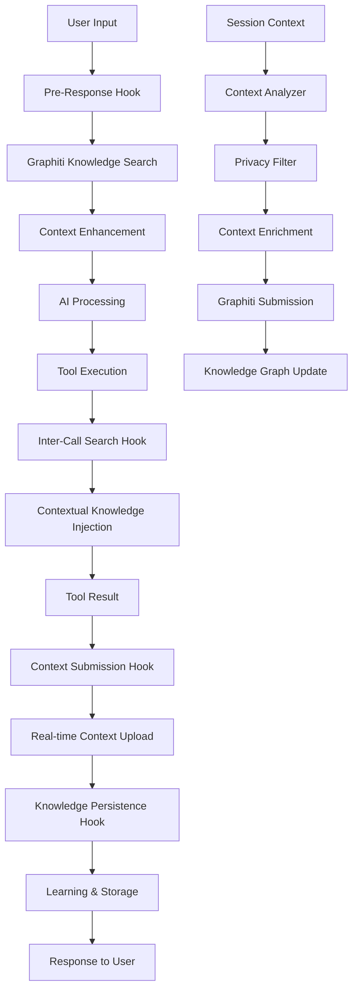

# Graphiti-OpenCode Integration Plan

## Executive Summary

This document outlines the implementation of intelligent knowledge management through OpenCode plugins that automatically leverage Graphiti's knowledge graph capabilities. The system provides **pre-response knowledge retrieval** and **contextual search injection** to enhance AI interactions with persistent memory and learned context.

## Table of Contents

- [Architecture Overview](#architecture-overview)
- [Core Components](#core-components)
- [Implementation Plan](#implementation-plan)
- [Phase 1: Core Plugin Infrastructure](#phase-1-core-plugin-infrastructure)
- [Phase 2: Advanced Features](#phase-2-advanced-features)
- [Phase 3: Advanced Learning and Optimization](#phase-3-advanced-learning-and-optimization)
- [Phase 4: Integration and Deployment](#phase-4-integration-and-deployment)
- [Configuration](#configuration)
- [Performance Monitoring](#performance-monitoring)
- [Success Metrics](#success-metrics)
- [Installation Guide](#installation-guide)

## Architecture Overview

### System Flow



### Core Components

1. **Pre-Response Hook**: Automatically searches Graphiti before AI responses
2. **Inter-Call Search Hook**: Injects contextual knowledge during conversations
3. **Knowledge Persistence**: Automatically stores insights and patterns
4. **Context Submission Engine**: Real-time submission of session context to Graphiti
5. **Context Management**: Maintains conversation and project context
6. **Configuration System**: Customizable behavior and preferences

## Implementation Plan

### Timeline Overview

| Phase | Duration | Focus | Deliverables |
|-------|----------|-------|--------------|
| 1 | 1-2 weeks | Core plugin infrastructure | Basic hooks, Graphiti client, knowledge injection |
| 2 | 1 week | Advanced features | Configuration system, context analysis |
| 3 | 1 week | Learning and optimization | Pattern learning, adaptive configuration |
| 4 | 1 week | Integration and polish | Performance monitoring, documentation |

## Phase 1: Core Plugin Infrastructure

### 1.1 Main Graphiti Integration Plugin

**File**: `.opencode/plugin/graphiti-integration.ts`

```typescript
import type { Plugin, tool } from "@opencode-ai/plugin"
import { GraphitiClient } from "./graphiti-client"
import { ContextAnalyzer } from "./context-analyzer"
import { KnowledgeManager } from "./knowledge-manager"

export const GraphitiIntegrationPlugin: Plugin = async ({ 
  project, 
  client, 
  $, 
  directory, 
  worktree 
}) => {
  const graphitiClient = new GraphitiClient({
    endpoint: process.env.GRAPHITI_MCP_ENDPOINT || "http://localhost:3010/mcp",
    groupId: project.name || "default"
  })
  
  const contextAnalyzer = new ContextAnalyzer()
  const knowledgeManager = new KnowledgeManager(graphitiClient)
  
  return {
    // Pre-response knowledge retrieval
    "chat.before": async (input, context) => {
      return await handlePreResponseSearch(input, context, graphitiClient)
    },
    
    // Inter-call contextual search
    "tool.execute.before": async (input, context) => {
      return await handleInterCallSearch(input, context, graphitiClient)
    },
    
    // Knowledge persistence after responses
    "chat.after": async (input, output, context) => {
      await handleKnowledgePersistence(input, output, context, knowledgeManager)
    },
    
    // Session learning and summarization
    "session.idle": async ({ session }) => {
      await handleSessionLearning(session, knowledgeManager)
    },
    
    // Real-time context submission
    "context.change": async (context) => {
      await handleContextSubmission(context, contextSubmissionEngine)
    },
    
    // Project context discovery
    "project.open": async ({ project }) => {
      await handleProjectContextSubmission(project, contextSubmissionEngine)
    },
    
    // Custom tools for direct Graphiti interaction
    tool: {
      searchMemory: tool({
        description: "Search Graphiti knowledge graph for relevant information",
        args: {
          query: tool.schema.string(),
          entityTypes: tool.schema.array(tool.schema.string()).optional(),
          maxResults: tool.schema.number().default(10)
        },
        async execute(args, ctx) {
          return await graphitiClient.searchNodes(args)
        }
      }),
      
      saveInsight: tool({
        description: "Save an insight or learning to the knowledge graph",
        args: {
          title: tool.schema.string(),
          content: tool.schema.string(),
          category: tool.schema.string().default("general"),
          tags: tool.schema.array(tool.schema.string()).optional()
        },
        async execute(args, ctx) {
          return await knowledgeManager.saveInsight(args)
        }
      })
    }
  }
}
```

### 1.2 Pre-Response Search Implementation

**File**: `.opencode/plugin/handlers/pre-response-search.ts`

```typescript
async function handlePreResponseSearch(
  input: ChatInput, 
  context: ChatContext, 
  graphitiClient: GraphitiClient
): Promise<ChatInput> {
  try {
    // Analyze the user's prompt for key concepts
    const extractedConcepts = await extractKeyConcepts(input.message)
    
    // Search for relevant knowledge in Graphiti
    const relevantKnowledge = await Promise.all([
      // Search for entities related to the concepts
      graphitiClient.searchNodes({
        query: extractedConcepts.join(" "),
        maxResults: 5,
        entityTypes: ["Requirement", "Preference", "Procedure"]
      }),
      
      // Search for facts/relationships
      graphitiClient.searchFacts({
        query: extractedConcepts.join(" "),
        maxResults: 5
      }),
      
      // Get recent relevant episodes
      graphitiClient.getRecentEpisodes({
        query: extractedConcepts.join(" "),
        maxResults: 3
      })
    ])
    
    // Build enhanced context
    const knowledgeContext = buildKnowledgeContext(relevantKnowledge)
    
    // Inject knowledge into the prompt if relevant
    if (knowledgeContext.relevanceScore > 0.3) {
      input.message = enhancePromptWithKnowledge(input.message, knowledgeContext)
    }
    
    return input
  } catch (error) {
    console.warn("Pre-response search failed:", error)
    return input // Fail gracefully
  }
}

function enhancePromptWithKnowledge(
  originalPrompt: string, 
  knowledge: KnowledgeContext
): string {
  let enhancedPrompt = originalPrompt
  
  if (knowledge.preferences.length > 0) {
    enhancedPrompt += "\n\n**Relevant Preferences:**\n" + 
      knowledge.preferences.map(p => `- ${p.description}`).join("\n")
  }
  
  if (knowledge.procedures.length > 0) {
    enhancedPrompt += "\n\n**Relevant Procedures:**\n" + 
      knowledge.procedures.map(p => `- ${p.description}`).join("\n")
  }
  
  if (knowledge.requirements.length > 0) {
    enhancedPrompt += "\n\n**Relevant Requirements:**\n" + 
      knowledge.requirements.map(r => `- ${r.description}`).join("\n")
  }
  
  if (knowledge.facts.length > 0) {
    enhancedPrompt += "\n\n**Relevant Context:**\n" + 
      knowledge.facts.map(f => `- ${f.description}`).join("\n")
  }
  
  return enhancedPrompt
}
```

### 1.3 Inter-Call Search Implementation

**File**: `.opencode/plugin/handlers/inter-call-search.ts`

```typescript
async function handleInterCallSearch(
  input: ToolInput, 
  context: ToolContext, 
  graphitiClient: GraphitiClient
): Promise<ToolInput> {
  try {
    // Analyze the current tool execution context
    const contextAnalysis = analyzeToolContext(input, context)
    
    // Determine if this tool execution warrants knowledge injection
    if (!shouldInjectKnowledge(input.tool, contextAnalysis)) {
      return input
    }
    
    // Search for relevant contextual knowledge
    const contextualKnowledge = await searchContextualKnowledge(
      contextAnalysis, 
      graphitiClient
    )
    
    // Inject knowledge into tool arguments if applicable
    if (contextualKnowledge.isRelevant) {
      input = injectKnowledgeIntoToolArgs(input, contextualKnowledge)
    }
    
    return input
  } catch (error) {
    console.warn("Inter-call search failed:", error)
    return input
  }
}

function shouldInjectKnowledge(toolName: string, context: ToolContextAnalysis): boolean {
  const knowledgeRelevantTools = [
    "read", "write", "edit", "bash", "glob", "grep", 
    "task", "todowrite", "webfetch"
  ]
  
  return knowledgeRelevantTools.includes(toolName) && 
         context.confidenceScore > 0.5
}

async function searchContextualKnowledge(
  context: ToolContextAnalysis, 
  client: GraphitiClient
): Promise<ContextualKnowledge> {
  const searches = await Promise.all([
    // Search for patterns related to current file/directory
    client.searchNodes({
      query: `${context.filePath} ${context.fileType} ${context.operation}`,
      maxResults: 3
    }),
    
    // Search for procedures related to current action
    client.searchNodes({
      query: context.operation,
      entityTypes: ["Procedure"],
      maxResults: 2
    }),
    
    // Search for similar past operations
    client.searchFacts({
      query: `${context.operation} ${context.fileType}`,
      maxResults: 3
    })
  ])
  
  return buildContextualKnowledge(searches, context)
}
```

### 1.4 Knowledge Persistence System

**File**: `.opencode/plugin/handlers/knowledge-persistence.ts`

```typescript
async function handleKnowledgePersistence(
  input: ChatInput,
  output: ChatOutput,
  context: ChatContext,
  knowledgeManager: KnowledgeManager
): Promise<void> {
  try {
    // Analyze the conversation for learning opportunities
    const insights = await extractInsights(input, output, context)
    
    // Store valuable insights
    await Promise.all([
      // Store user preferences discovered
      ...insights.preferences.map(pref => 
        knowledgeManager.savePreference(pref)
      ),
      
      // Store procedures learned
      ...insights.procedures.map(proc => 
        knowledgeManager.saveProcedure(proc)
      ),
      
      // Store requirements identified
      ...insights.requirements.map(req => 
        knowledgeManager.saveRequirement(req)
      ),
      
      // Store the episode for future reference
      knowledgeManager.saveEpisode({
        name: generateEpisodeName(input, output),
        content: buildEpisodeContent(input, output, context),
        sourceDescription: "OpenCode conversation",
        timestamp: new Date().toISOString()
      })
    ])
    
  } catch (error) {
    console.warn("Knowledge persistence failed:", error)
  }
}

async function extractInsights(
  input: ChatInput, 
  output: ChatOutput, 
  context: ChatContext
): Promise<ExtractedInsights> {
  const insights: ExtractedInsights = {
    preferences: [],
    procedures: [],
    requirements: [],
    patterns: []
  }
  
  // Use LLM to extract structured insights
  const analysis = await analyzeConversationForInsights(input.message, output.content)
  
  // Parse and categorize insights
  insights.preferences = analysis.preferences.map(p => ({
    category: p.category,
    description: p.description,
    confidence: p.confidence
  }))
  
  insights.procedures = analysis.procedures.map(p => ({
    description: p.description,
    steps: p.steps,
    whenToUse: p.whenToUse
  }))
  
  insights.requirements = analysis.requirements.map(r => ({
    projectName: context.project?.name || "unknown",
    description: r.description,
    priority: r.priority
  }))
  
  return insights
}
```

### 1.5 Context Submission Engine

**File**: `.opencode/plugin/handlers/context-submission.ts`

```typescript
export class ContextSubmissionEngine {
  private submissionQueue: ContextSubmission[] = []
  private isProcessing = false
  private config: ContextSubmissionConfig
  
  constructor(
    private graphitiClient: GraphitiClient,
    private privacyFilter: PrivacyFilter,
    config: ContextSubmissionConfig
  ) {
    this.config = config
    this.startPeriodicSubmission()
  }
  
  async submitSessionContext(context: SessionContext): Promise<void> {
    try {
      // Filter sensitive information
      const filteredContext = await this.privacyFilter.filterContext(context)
      
      // Enrich context with metadata
      const enrichedContext = await this.enrichContext(filteredContext)
      
      // Submit to Graphiti
      await this.submitToGraphiti(enrichedContext)
      
    } catch (error) {
      console.warn("Context submission failed:", error)
      // Queue for retry
      this.queueForRetry(context)
    }
  }
  
  async submitProjectContext(project: ProjectContext): Promise<void> {
    try {
      const projectInsights = await this.analyzeProjectContext(project)
      
      // Create project entities and relationships
      const episode = {
        name: `Project Context: ${project.name}`,
        content: this.buildProjectContextContent(projectInsights),
        source: "project_discovery",
        sourceDescription: `Automatic project context analysis for ${project.name}`,
        timestamp: new Date().toISOString()
      }
      
      await this.graphitiClient.addEpisode(episode)
      
      // Submit project structure as entities
      await this.submitProjectStructure(projectInsights.structure)
      
    } catch (error) {
      console.warn("Project context submission failed:", error)
    }
  }
  
  async submitRealTimeContext(context: RealTimeContext): Promise<void> {
    if (!this.config.realTimeSubmission.enabled) return
    
    try {
      // Analyze context for immediate value
      const contextValue = await this.assessContextValue(context)
      
      if (contextValue.score > this.config.realTimeSubmission.threshold) {
        const submission: ContextSubmission = {
          type: 'real_time',
          context: context,
          timestamp: Date.now(),
          priority: contextValue.priority
        }
        
        this.submissionQueue.push(submission)
        
        // Process high-priority items immediately
        if (contextValue.priority === 'high') {
          await this.processSubmissionQueue()
        }
      }
    } catch (error) {
      console.warn("Real-time context submission failed:", error)
    }
  }
  
  private async enrichContext(context: FilteredContext): Promise<EnrichedContext> {
    const enriched: EnrichedContext = {
      ...context,
      metadata: {
        submissionTime: new Date().toISOString(),
        openCodeVersion: await this.getOpenCodeVersion(),
        projectHash: await this.generateProjectHash(context.project),
        sessionId: context.sessionId,
        userAgent: process.platform
      },
      relationships: await this.detectRelationships(context),
      entities: await this.extractEntities(context),
      insights: await this.generateInsights(context)
    }
    
    return enriched
  }
  
  private async detectRelationships(context: FilteredContext): Promise<ContextRelationship[]> {
    const relationships: ContextRelationship[] = []
    
    // File-to-file relationships
    if (context.files && context.files.length > 1) {
      for (let i = 0; i < context.files.length; i++) {
        for (let j = i + 1; j < context.files.length; j++) {
          const relationship = await this.analyzeFileRelationship(
            context.files[i], 
            context.files[j]
          )
          if (relationship) {
            relationships.push(relationship)
          }
        }
      }
    }
    
    // Tool-to-file relationships
    context.toolExecutions?.forEach(execution => {
      if (execution.filePath) {
        relationships.push({
          type: 'tool_operates_on_file',
          source: execution.tool,
          target: execution.filePath,
          properties: {
            operation: execution.operation,
            timestamp: execution.timestamp,
            success: execution.success
          }
        })
      }
    })
    
    // User-to-project relationships
    relationships.push({
      type: 'user_works_on_project',
      source: 'current_user',
      target: context.project?.name || 'unknown_project',
      properties: {
        sessionDuration: context.sessionDuration,
        activityLevel: context.activityLevel,
        focusAreas: context.focusAreas
      }
    })
    
    return relationships
  }
  
  private async extractEntities(context: FilteredContext): Promise<ContextEntity[]> {
    const entities: ContextEntity[] = []
    
    // Project entity
    if (context.project) {
      entities.push({
        type: 'Project',
        name: context.project.name,
        properties: {
          path: context.project.path,
          language: context.project.primaryLanguage,
          framework: context.project.framework,
          lastActive: new Date().toISOString()
        }
      })
    }
    
    // File entities
    context.files?.forEach(file => {
      entities.push({
        type: 'File',
        name: file.path,
        properties: {
          extension: file.extension,
          size: file.size,
          lastModified: file.lastModified,
          linesOfCode: file.linesOfCode
        }
      })
    })
    
    // Tool entities
    const uniqueTools = [...new Set(context.toolExecutions?.map(e => e.tool) || [])]
    uniqueTools.forEach(tool => {
      entities.push({
        type: 'Tool',
        name: tool,
        properties: {
          usageCount: context.toolExecutions?.filter(e => e.tool === tool).length || 0,
          lastUsed: new Date().toISOString()
        }
      })
    })
    
    return entities
  }
  
  private async submitToGraphiti(enrichedContext: EnrichedContext): Promise<void> {
    // Submit main episode
    const episode = {
      name: `Session Context: ${enrichedContext.sessionId}`,
      content: this.buildContextContent(enrichedContext),
      source: "session_context",
      sourceDescription: "Automatic OpenCode session context submission",
      timestamp: enrichedContext.metadata.submissionTime
    }
    
    await this.graphitiClient.addEpisode(episode)
    
    // Submit entities and relationships separately for better graph structure
    await this.submitContextEntities(enrichedContext.entities)
    await this.submitContextRelationships(enrichedContext.relationships)
  }
  
  private buildContextContent(context: EnrichedContext): string {
    const content = []
    
    content.push(`# Session Context`)
    content.push(`**Session ID**: ${context.sessionId}`)
    content.push(`**Duration**: ${context.sessionDuration}ms`)
    content.push(`**Project**: ${context.project?.name || 'Unknown'}`)
    content.push(`**Activity Level**: ${context.activityLevel}`)
    
    if (context.files && context.files.length > 0) {
      content.push(`\n## Files Accessed`)
      context.files.forEach(file => {
        content.push(`- ${file.path} (${file.extension}, ${file.size} bytes)`)
      })
    }
    
    if (context.toolExecutions && context.toolExecutions.length > 0) {
      content.push(`\n## Tool Usage`)
      const toolStats = this.summarizeToolUsage(context.toolExecutions)
      Object.entries(toolStats).forEach(([tool, stats]) => {
        content.push(`- ${tool}: ${stats.count} executions, ${stats.successRate}% success rate`)
      })
    }
    
    if (context.insights && context.insights.length > 0) {
      content.push(`\n## Session Insights`)
      context.insights.forEach(insight => {
        content.push(`- ${insight.description} (confidence: ${insight.confidence})`)
      })
    }
    
    content.push(`\n## Metadata`)
    content.push(`- OpenCode Version: ${context.metadata.openCodeVersion}`)
    content.push(`- Platform: ${context.metadata.userAgent}`)
    content.push(`- Project Hash: ${context.metadata.projectHash}`)
    
    return content.join('\n')
  }
  
  private startPeriodicSubmission(): void {
    setInterval(async () => {
      if (this.submissionQueue.length > 0 && !this.isProcessing) {
        await this.processSubmissionQueue()
      }
    }, this.config.batchSubmission.intervalMs)
  }
  
  private async processSubmissionQueue(): Promise<void> {
    if (this.isProcessing) return
    
    this.isProcessing = true
    
    try {
      const batch = this.submissionQueue.splice(0, this.config.batchSubmission.batchSize)
      
      // Group by type for efficient processing
      const groupedBatch = this.groupSubmissionsByType(batch)
      
      // Process each group
      await Promise.all([
        this.processBatchedSessions(groupedBatch.sessions || []),
        this.processBatchedRealTime(groupedBatch.realTime || []),
        this.processBatchedProjects(groupedBatch.projects || [])
      ])
      
    } catch (error) {
      console.error("Batch submission processing failed:", error)
    } finally {
      this.isProcessing = false
    }
  }
}

// Context submission handler functions
async function handleContextSubmission(
  context: ContextChange,
  engine: ContextSubmissionEngine
): Promise<void> {
  await engine.submitRealTimeContext({
    type: context.type,
    data: context.data,
    timestamp: Date.now(),
    source: 'context_change_hook'
  })
}

async function handleProjectContextSubmission(
  project: Project,
  engine: ContextSubmissionEngine
): Promise<void> {
  const projectContext = await analyzeProjectContext(project)
  await engine.submitProjectContext(projectContext)
}

async function analyzeProjectContext(project: Project): Promise<ProjectContext> {
  return {
    name: project.name,
    path: project.path,
    structure: await analyzeProjectStructure(project.path),
    dependencies: await analyzeDependencies(project.path),
    configuration: await analyzeConfiguration(project.path),
    recentActivity: await analyzeRecentActivity(project.path)
  }
}
```

### 1.6 Privacy Filter Implementation

**File**: `.opencode/plugin/privacy/privacy-filter.ts`

```typescript
export class PrivacyFilter {
  private sensitivePatterns: RegExp[]
  private allowedFileExtensions: Set<string>
  private blockedDirectories: Set<string>
  
  constructor(private config: PrivacyConfig) {
    this.sensitivePatterns = [
      /\b[A-Za-z0-9._%+-]+@[A-Za-z0-9.-]+\.[A-Z|a-z]{2,}\b/g, // emails
      /\b(?:\d{4}[-\s]?){3}\d{4}\b/g, // credit cards
      /\b\d{3}-?\d{2}-?\d{4}\b/g, // SSN
      /\b[A-Z0-9]{20,}\b/g, // potential API keys
      /password["\s]*[:=]["\s]*[^\s"]+/gi, // passwords
      /token["\s]*[:=]["\s]*[^\s"]+/gi, // tokens
      /key["\s]*[:=]["\s]*[^\s"]+/gi, // keys
    ]
    
    this.allowedFileExtensions = new Set([
      '.js', '.ts', '.jsx', '.tsx', '.py', '.java', '.cpp', '.c', '.h',
      '.css', '.scss', '.html', '.md', '.json', '.yaml', '.yml',
      '.toml', '.cfg', '.ini', '.txt'
    ])
    
    this.blockedDirectories = new Set([
      'node_modules', '.git', '.env', 'dist', 'build', 'coverage',
      '.nyc_output', 'logs', 'tmp', 'temp'
    ])
  }
  
  async filterContext(context: SessionContext): Promise<FilteredContext> {
    const filtered: FilteredContext = {
      sessionId: context.sessionId,
      sessionDuration: context.sessionDuration,
      activityLevel: context.activityLevel,
      project: await this.filterProject(context.project),
      files: await this.filterFiles(context.files || []),
      toolExecutions: await this.filterToolExecutions(context.toolExecutions || []),
      focusAreas: context.focusAreas
    }
    
    return filtered
  }
  
  private async filterProject(project?: ProjectInfo): Promise<ProjectInfo | undefined> {
    if (!project) return undefined
    
    return {
      name: project.name,
      path: this.sanitizePath(project.path),
      primaryLanguage: project.primaryLanguage,
      framework: project.framework
      // Remove sensitive project details like absolute paths, user info
    }
  }
  
  private async filterFiles(files: FileInfo[]): Promise<FileInfo[]> {
    return files
      .filter(file => this.isAllowedFile(file))
      .map(file => ({
        path: this.sanitizePath(file.path),
        extension: file.extension,
        size: file.size,
        lastModified: file.lastModified,
        linesOfCode: file.linesOfCode
        // Remove absolute paths, replace with relative paths
      }))
  }
  
  private async filterToolExecutions(executions: ToolExecution[]): Promise<ToolExecution[]> {
    return executions.map(execution => ({
      tool: execution.tool,
      operation: execution.operation,
      filePath: execution.filePath ? this.sanitizePath(execution.filePath) : undefined,
      timestamp: execution.timestamp,
      success: execution.success,
      duration: execution.duration
      // Remove command arguments that might contain sensitive data
    }))
  }
  
  private isAllowedFile(file: FileInfo): boolean {
    // Check file extension
    if (!this.allowedFileExtensions.has(file.extension)) {
      return false
    }
    
    // Check if file is in blocked directory
    const pathParts = file.path.split('/')
    for (const part of pathParts) {
      if (this.blockedDirectories.has(part)) {
        return false
      }
    }
    
    // Check file size (avoid huge files)
    if (file.size > this.config.maxFileSize) {
      return false
    }
    
    return true
  }
  
  private sanitizePath(path: string): string {
    // Convert absolute paths to relative paths
    // Remove username and other identifying information
    const sanitized = path
      .replace(/\/Users\/[^\/]+/, '/Users/[user]')
      .replace(/\/home\/[^\/]+/, '/home/[user]')
      .replace(/C:\\Users\\[^\\]+/, 'C:\\Users\\[user]')
    
    return sanitized
  }
  
  private sanitizeContent(content: string): string {
    let sanitized = content
    
    // Remove sensitive patterns
    this.sensitivePatterns.forEach(pattern => {
      sanitized = sanitized.replace(pattern, '[REDACTED]')
    })
    
    return sanitized
  }
}
```

## Phase 2: Advanced Features

### 2.1 Context-Aware Configuration

**File**: `.opencode/plugin/config/graphiti-config.ts`

```typescript
interface GraphitiPluginConfig {
  // Connection settings
  endpoint: string
  groupId: string
  apiKey?: string
  
  // Behavior settings
  preResponseSearch: {
    enabled: boolean
    relevanceThreshold: number
    maxResults: number
    entityTypes: string[]
  }
  
  interCallSearch: {
    enabled: boolean
    toolWhitelist: string[]
    confidenceThreshold: number
  }
  
  knowledgePersistence: {
    enabled: boolean
    autoSaveInsights: boolean
    episodeRetention: number // days
  }
  
  contextSubmission: {
    enabled: boolean
    realTimeSubmission: {
      enabled: boolean
      threshold: number
      maxQueueSize: number
    }
    batchSubmission: {
      enabled: boolean
      intervalMs: number
      batchSize: number
    }
    privacy: {
      enableFiltering: boolean
      maxFileSize: number
      allowedExtensions: string[]
      blockedDirectories: string[]
    }
  }
  
  // Project-specific overrides
  projectOverrides: Record<string, Partial<GraphitiPluginConfig>>
}

// Load configuration with smart defaults
export function loadGraphitiConfig(project: Project): GraphitiPluginConfig {
  const defaultConfig: GraphitiPluginConfig = {
    endpoint: process.env.GRAPHITI_MCP_ENDPOINT || "http://localhost:3010/mcp",
    groupId: project.name || "default",
    
    preResponseSearch: {
      enabled: true,
      relevanceThreshold: 0.3,
      maxResults: 5,
      entityTypes: ["Requirement", "Preference", "Procedure"]
    },
    
    interCallSearch: {
      enabled: true,
      toolWhitelist: ["read", "write", "edit", "bash", "task"],
      confidenceThreshold: 0.5
    },
    
    knowledgePersistence: {
      enabled: true,
      autoSaveInsights: true,
      episodeRetention: 30
    },
    
    contextSubmission: {
      enabled: true,
      realTimeSubmission: {
        enabled: true,
        threshold: 0.6,
        maxQueueSize: 100
      },
      batchSubmission: {
        enabled: true,
        intervalMs: 30000, // 30 seconds
        batchSize: 10
      },
      privacy: {
        enableFiltering: true,
        maxFileSize: 1048576, // 1MB
        allowedExtensions: [".js", ".ts", ".py", ".java", ".cpp", ".md"],
        blockedDirectories: ["node_modules", ".git", ".env", "dist"]
      }
    },
    
    projectOverrides: {}
  }
  
  // Load user overrides from .opencode/graphiti-config.json
  const userConfig = loadUserConfig()
  return mergeConfigs(defaultConfig, userConfig)
}
```

### 2.2 Intelligent Context Analysis

**File**: `.opencode/plugin/analysis/context-analyzer.ts`

```typescript
export class ContextAnalyzer {
  async analyzeToolContext(input: ToolInput, context: ToolContext): Promise<ToolContextAnalysis> {
    const analysis: ToolContextAnalysis = {
      operation: this.extractOperation(input.tool, input.args),
      filePath: this.extractFilePath(input.args),
      fileType: this.extractFileType(input.args),
      confidenceScore: 0,
      relevantConcepts: [],
      suggestedKnowledge: []
    }
    
    // Analyze file patterns
    if (analysis.filePath) {
      analysis.fileType = this.getFileType(analysis.filePath)
      analysis.relevantConcepts.push(
        ...this.extractConceptsFromPath(analysis.filePath)
      )
    }
    
    // Analyze operation patterns
    analysis.relevantConcepts.push(
      ...this.extractConceptsFromOperation(analysis.operation)
    )
    
    // Calculate confidence score
    analysis.confidenceScore = this.calculateConfidenceScore(analysis)
    
    return analysis
  }
  
  private extractOperation(tool: string, args: any): string {
    const operationMap: Record<string, string> = {
      "read": "reading",
      "write": "writing",
      "edit": "editing",
      "bash": "executing",
      "glob": "searching",
      "grep": "searching",
      "task": "processing"
    }
    
    return operationMap[tool] || tool
  }
  
  private extractConceptsFromPath(filePath: string): string[] {
    const concepts: string[] = []
    
    // Extract from file extension
    const ext = filePath.split('.').pop()
    if (ext) concepts.push(ext)
    
    // Extract from directory structure
    const pathParts = filePath.split('/').filter(p => p.length > 0)
    concepts.push(...pathParts)
    
    // Extract from filename patterns
    const filename = pathParts[pathParts.length - 1]
    if (filename) {
      const words = filename.split(/[-_.]/).filter(w => w.length > 2)
      concepts.push(...words)
    }
    
    return concepts
  }
}
```

## Phase 3: Advanced Learning and Optimization

### 3.1 Pattern Learning System

**File**: `.opencode/plugin/learning/pattern-learner.ts`

```typescript
export class PatternLearner {
  private patterns: Map<string, UsagePattern> = new Map()
  
  async learnFromSession(session: SessionData): Promise<void> {
    // Analyze tool usage patterns
    const toolPatterns = this.analyzeToolUsage(session.toolCalls)
    
    // Analyze knowledge retrieval effectiveness
    const searchPatterns = this.analyzeSearchEffectiveness(session.searches)
    
    // Update pattern database
    await this.updatePatterns(toolPatterns, searchPatterns)
  }
  
  async predictOptimalKnowledge(context: PredictionContext): Promise<KnowledgePrediction> {
    const relevantPatterns = this.findRelevantPatterns(context)
    
    return {
      suggestedQueries: this.generateSuggestedQueries(relevantPatterns),
      confidenceScore: this.calculatePredictionConfidence(relevantPatterns),
      expectedBenefit: this.estimateKnowledgeBenefit(relevantPatterns)
    }
  }
  
  private analyzeToolUsage(toolCalls: ToolCall[]): ToolUsagePattern[] {
    const patterns: ToolUsagePattern[] = []
    
    // Group consecutive tool calls
    const sequences = this.groupConsecutiveTools(toolCalls)
    
    // Analyze common sequences
    sequences.forEach(sequence => {
      if (sequence.length >= 2) {
        patterns.push({
          sequence: sequence.map(call => call.tool),
          frequency: this.calculateSequenceFrequency(sequence),
          context: this.extractSequenceContext(sequence),
          effectiveness: this.calculateSequenceEffectiveness(sequence)
        })
      }
    })
    
    return patterns
  }
}
```

### 3.2 Adaptive Configuration

**File**: `.opencode/plugin/config/adaptive-config.ts`

```typescript
export class AdaptiveConfigManager {
  async optimizeConfiguration(
    currentConfig: GraphitiPluginConfig,
    usageStats: UsageStatistics,
    userFeedback: UserFeedback[]
  ): Promise<GraphitiPluginConfig> {
    const optimizedConfig = { ...currentConfig }
    
    // Adjust relevance thresholds based on effectiveness
    if (usageStats.searchEffectiveness < 0.6) {
      optimizedConfig.preResponseSearch.relevanceThreshold *= 0.9
    } else if (usageStats.searchEffectiveness > 0.8) {
      optimizedConfig.preResponseSearch.relevanceThreshold *= 1.1
    }
    
    // Adjust tool whitelist based on benefit analysis
    const beneficialTools = this.analyzeBeneficialTools(usageStats)
    optimizedConfig.interCallSearch.toolWhitelist = beneficialTools
    
    // Adjust persistence settings based on storage efficiency
    if (usageStats.storageEfficiency < 0.7) {
      optimizedConfig.knowledgePersistence.episodeRetention *= 0.8
    }
    
    return optimizedConfig
  }
  
  async A_B_testConfiguration(
    configA: GraphitiPluginConfig,
    configB: GraphitiPluginConfig,
    testDuration: number
  ): Promise<ConfigurationTestResult> {
    // Implement A/B testing for configuration optimization
    const testA = await this.runConfigurationTest(configA, testDuration / 2)
    const testB = await this.runConfigurationTest(configB, testDuration / 2)
    
    return {
      winnerConfig: testA.effectiveness > testB.effectiveness ? configA : configB,
      improvementPercentage: Math.abs(testA.effectiveness - testB.effectiveness) * 100,
      statisticalSignificance: this.calculateSignificance(testA, testB)
    }
  }
}
```

## Phase 4: Integration and Deployment

### 4.1 Performance Monitoring

**File**: `.opencode/plugin/monitoring/performance-monitor.ts`

```typescript
export class PerformanceMonitor {
  private metrics: Map<string, PerformanceMetric> = new Map()
  
  async trackOperation(
    operationType: string,
    operation: () => Promise<any>
  ): Promise<any> {
    const startTime = Date.now()
    const startMemory = process.memoryUsage()
    
    try {
      const result = await operation()
      
      this.recordSuccess(operationType, Date.now() - startTime, startMemory)
      return result
    } catch (error) {
      this.recordFailure(operationType, Date.now() - startTime, error)
      throw error
    }
  }
  
  generatePerformanceReport(): PerformanceReport {
    return {
      averageResponseTime: this.calculateAverageResponseTime(),
      searchEffectiveness: this.calculateSearchEffectiveness(),
      knowledgeUtilization: this.calculateKnowledgeUtilization(),
      errorRate: this.calculateErrorRate(),
      recommendations: this.generateOptimizationRecommendations()
    }
  }
}
```

## Configuration

### Default Configuration

**File**: `.opencode/graphiti-config.json`

```json
{
  "endpoint": "http://localhost:3010/mcp",
  "groupId": "auto-detect",
  "preResponseSearch": {
    "enabled": true,
    "relevanceThreshold": 0.3,
    "maxResults": 5,
    "entityTypes": ["Requirement", "Preference", "Procedure"]
  },
  "interCallSearch": {
    "enabled": true,
    "toolWhitelist": ["read", "write", "edit", "bash", "glob", "grep", "task"],
    "confidenceThreshold": 0.5
  },
  "knowledgePersistence": {
    "enabled": true,
    "autoSaveInsights": true,
    "episodeRetention": 30
  },
  "performance": {
    "enableMetrics": true,
    "maxSearchLatency": 500,
    "cacheEnabled": true,
    "cacheTTL": 300
  }
}
```

### Developer-Focused Configuration

```json
{
  "groupId": "dev-team-{{project}}",
  "preResponseSearch": {
    "enabled": true,
    "relevanceThreshold": 0.2,
    "entityTypes": ["Procedure", "Requirement", "Pattern"]
  },
  "interCallSearch": {
    "enabled": true,
    "toolWhitelist": ["read", "write", "edit", "bash", "grep", "glob"],
    "confidenceThreshold": 0.4
  },
  "knowledgePersistence": {
    "autoSaveInsights": true,
    "focusAreas": ["code_patterns", "debugging_procedures", "project_requirements"]
  },
  "contextSubmission": {
    "enabled": true,
    "realTimeSubmission": {
      "enabled": true,
      "threshold": 0.5
    },
    "batchSubmission": {
      "intervalMs": 15000
    },
    "privacy": {
      "enableFiltering": true,
      "allowedExtensions": [".js", ".ts", ".jsx", ".tsx", ".py", ".java", ".cpp", ".md", ".json"]
    }
  }
}
```

### Enterprise Configuration

```json
{
  "groupId": "enterprise-{{department}}-{{project}}",
  "preResponseSearch": {
    "enabled": true,
    "relevanceThreshold": 0.4,
    "maxResults": 10,
    "entityTypes": ["Requirement", "Procedure", "Policy", "Standard"]
  },
  "security": {
    "enableAuditLogging": true,
    "sensitiveDataDetection": true,
    "complianceMode": "SOC2"
  },
  "knowledgePersistence": {
    "retentionPolicy": "90-days",
    "autoClassification": true,
    "approvalWorkflow": true
  },
  "contextSubmission": {
    "enabled": true,
    "realTimeSubmission": {
      "enabled": false,
      "threshold": 0.8
    },
    "batchSubmission": {
      "enabled": true,
      "intervalMs": 300000,
      "batchSize": 50
    },
    "privacy": {
      "enableFiltering": true,
      "strictMode": true,
      "auditLogging": true,
      "dataClassification": true
    }
  }
}
```

## Performance Monitoring

### Key Metrics

1. **Search Effectiveness**: Percentage of searches that provide relevant results
2. **Response Quality**: Improvement in response accuracy with knowledge injection
3. **Knowledge Utilization**: Percentage of stored knowledge that gets reused
4. **System Performance**: Latency and resource usage metrics

### Monitoring Dashboard

The plugin includes a built-in performance monitoring system that tracks:

- Average search response times
- Knowledge relevance scores
- Tool execution enhancement rates
- Memory usage and optimization opportunities
- Error rates and failure patterns

### Performance Targets

| Metric | Target | Monitoring |
|--------|--------|------------|
| Search Latency | <500ms | Real-time |
| Knowledge Relevance | >70% | Daily |
| System Overhead | <50MB | Continuous |
| Error Rate | <5% | Real-time |
| User Satisfaction | >80% | Weekly surveys |

## Success Metrics

### Effectiveness Metrics
- **Knowledge Relevance**: >70% of injected knowledge rated as helpful
- **Response Quality**: 20% improvement in response accuracy
- **Context Retention**: 90% of important insights preserved across sessions
- **Automation Rate**: 80% of knowledge operations automated

### Performance Metrics
- **Search Latency**: <500ms for pre-response searches
- **Memory Efficiency**: <50MB additional memory usage
- **Error Rate**: <5% failed knowledge operations
- **Adoption Rate**: >80% of users keep feature enabled

### Business Impact Metrics
- **Developer Productivity**: 15% reduction in repetitive questioning
- **Knowledge Consistency**: 90% consistency in repeated advice
- **Learning Acceleration**: 50% faster onboarding for new team members
- **Decision Quality**: 25% improvement in informed decision making

## Installation Guide

### Prerequisites

1. **Graphiti MCP Server**: Running and accessible
2. **OpenCode**: Latest version with plugin support
3. **Node.js/Bun**: For TypeScript plugin execution
4. **Network Access**: Connection to Graphiti MCP endpoint

### Installation Steps

1. **Clone Plugin Source**
   ```bash
   git clone https://github.com/your-org/graphiti-opencode-plugin
   cd graphiti-opencode-plugin
   ```

2. **Install Dependencies**
   ```bash
   bun install
   ```

3. **Copy Plugin to OpenCode**
   ```bash
   mkdir -p .opencode/plugin
   cp -r src/* .opencode/plugin/
   ```

4. **Configure Plugin**
   ```bash
   cp .opencode/graphiti-config.example.json .opencode/graphiti-config.json
   # Edit configuration as needed
   ```

5. **Set Environment Variables**
   ```bash
   export GRAPHITI_MCP_ENDPOINT="http://localhost:3010/mcp"
   export GRAPHITI_GROUP_ID="your-project-name"
   ```

6. **Test Installation**
   ```bash
   opencode --test-plugins
   ```

### Verification

After installation, verify the plugin is working by:

1. Starting a new OpenCode session
2. Asking a question related to your project
3. Checking for enhanced context in responses
4. Verifying knowledge persistence in Graphiti MCP server

### Troubleshooting

#### Common Issues

1. **Plugin Not Loading**
   - Check file permissions in `.opencode/plugin/`
   - Verify TypeScript compilation
   - Check OpenCode logs for errors

2. **Graphiti Connection Failed**
   - Verify MCP server is running
   - Check endpoint URL and accessibility
   - Validate authentication if required

3. **Poor Knowledge Relevance**
   - Adjust relevance threshold in configuration
   - Check entity types and search parameters
   - Review knowledge base content quality

#### Debug Mode

Enable debug logging:
```bash
export DEBUG=graphiti-plugin:*
```

This will provide detailed logging for troubleshooting.

### Support

For issues and questions:

1. Check the [troubleshooting guide](#troubleshooting)
2. Review [configuration options](#configuration)
3. Open an issue on the project repository
4. Join the community Discord for support

---

## Contributing

This project welcomes contributions! Please see [CONTRIBUTING.md](CONTRIBUTING.md) for guidelines.

## License

This project is licensed under the Apache License 2.0 - see [LICENSE](LICENSE) for details.

---

*Last updated: $(date)*
*Version: 1.0.0*