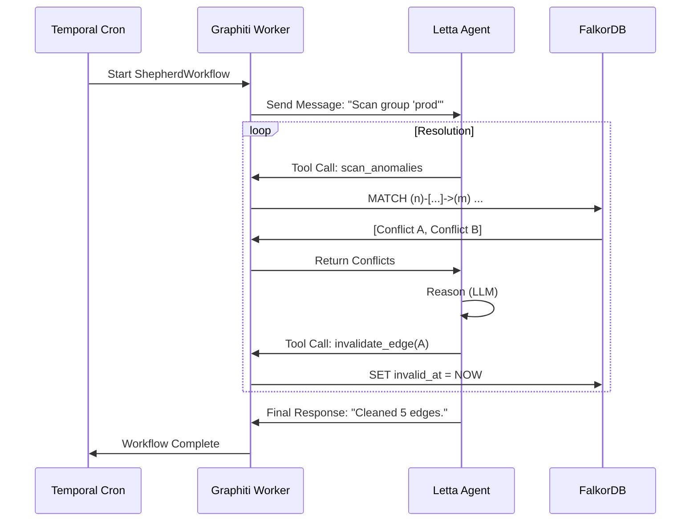

# Product Requirement Document (PRD): Letta Shepherd Agent (Temporal Integration)

## 1. Executive Summary
**Objective:** Deploy a specialized **Letta Agent** ("The Shepherd") to autonomously monitor, validate, and repair the Graphiti knowledge graph, orchestrated via **Temporal Workflows**.
**Problem:** The graph accumulates conflicting facts over time. We need a robust, scheduled maintenance process that fits into our existing Temporal-based architecture.
**Solution:**
1.  **Temporal Workflow:** A scheduled `ShepherdMaintenanceWorkflow` runs periodically (e.g., nightly).
2.  **Letta Agent:** Receives a "Scan" command from the Workflow. It reasons about conflicts and calls Graphiti Tools to fix them.
3.  **Graphiti Tools:** Expose `scan_conflicts` and `resolve_edge` as Letta Tools.

## 2. Architecture

### A. The Temporal Workflow (`graphiti_core/workflows/shepherd.py`)
We leverages Temporal's native Cron scheduling.

*   **Workflow:** `ShepherdMaintenanceWorkflow`
    *   *Schedule:* `@every 24h` (Configurable)
    *   *Steps:*
        1.  **Activity:** `TriggerShepherdAgent(group_id)`
        2.  **Activity (Optional):** `GenerateMaintenanceReport`

### B. The Letta Agent ("Shepherd")
*   **Persona:** "I am the Graph Shepherd. I maintain the consistency of the Knowledge Graph."
*   **Trigger:** Receives a message: *"Run maintenance scan for group '{group_id}'."*
*   **Loop:**
    1.  Calls `scan_anomalies(group_id)` to get a list of potential conflicts.
    2.  For each conflict:
        *   Calls `get_edge_context(uuids)` to see the facts.
        *   **Reasoning:** "Edge A says 'Live in NYC' (2022). Edge B says 'Live in London' (2024). B is newer."
        *   Calls `invalidate_edge(uuid_A, reason="Superseded by newer fact")`.
    3.  Report results.

### C. The Graphiti Tools (Exposed to Letta)
Implemented in `graphiti_core/shepherd/tools.py`.

1.  **`scan_anomalies(group_id: str)`**:
    *   *Cypher:* Finds nodes with >1 active `CURRENT_*` edges or future `valid_at`.
2.  **`get_edge_context(edge_uuids: List[str])`**:
    *   *Cypher:* Returns formatted string of edge properties.
3.  **`invalidate_edge(edge_uuid: str, reason: str)`**:
    *   *Cypher:* `MATCH (e {uuid: $uuid}) SET e.invalid_at = timestamp(), e.invalidation_reason = $reason`

## 3. Implementation Plan

### Step 1: Tool Implementation
Create `graphiti_core/shepherd/tools.py` with the FalkorDB query wrappers.

### Step 2: Temporal Integration
Create `graphiti_core/utils/temporal/shepherd_workflow.py`.
*   Define `ShepherdWorkflow` class.
*   Define `trigger_shepherd_activity`.

### Step 3: Agent Configuration
Create a script `scripts/setup_shepherd.py` to:
1.  Initialize the Letta Client.
2.  Create the `shepherd-v1` agent.
3.  Register the tools from Step 1.

## 4. Workflow Diagram

## 5. Success Metrics
*   **Automation:** Zero manual intervention required for graph cleanup.
*   **Consistency:** Conflicting single-cardinality edges (like `CURRENT_CITY`) don't persist > 24 hours.
*   **Observability:** All actions are visible in Temporal History and Letta Message Logs.