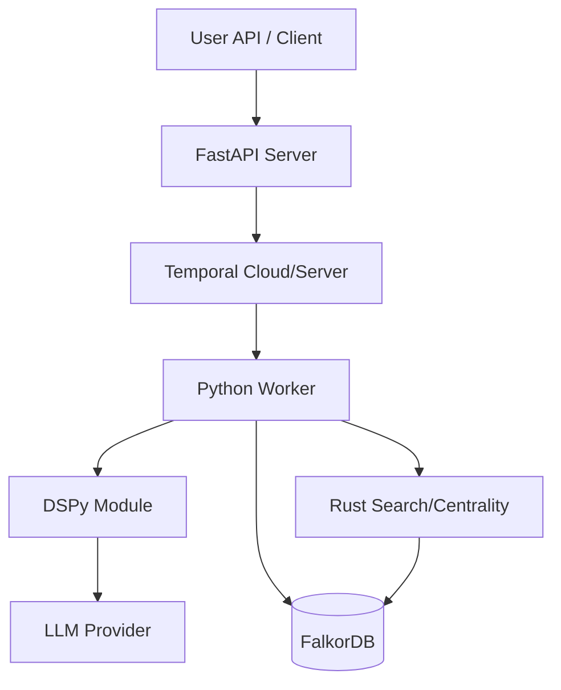

# Graphiti Architecture Review & Consolidation Plan

## 1. Executive Summary
Graphiti is in a **transition state** between a legacy architecture (Neo4j, monolithic ingestion) and a modern architecture (FalkorDB, Temporal, DSPy). Currently, both exist side-by-side, creating significant technical debt, confusion, and maintenance overhead.

This document outlines a plan to **aggressively consolidate** the stack, removing dead code and unifying the system around the new "Temporal + FalkorDB + DSPy" core.

## 2. Components to Decommission (The "Kill List")

| Component | Status | Recommendation | Impact |
| :--- | :--- | :--- | :--- |
| **Neo4j Support** | 🛑 Legacy | **REMOVE.** The project has pivoted to FalkorDB (Redis). Maintaining two graph dialects (Cypher for Neo4j vs. Cypher for Falkor) is a huge burden. | `graphiti_core/driver/neo4j_driver.py` can be deleted. `docker-compose.yml` can remove the Neo4j container. |
| **Sync Service** | 🛑 Legacy | **REMOVE.** Originally used to sync Neo4j -> FalkorDB. Now that FalkorDB is the primary source of truth (with RDB persistence), this complex Rust service is obsolete. | `graphiti-sync-rs` container and all related scripts. |
| **Legacy Ingestion Worker** | ⚠️ Deprecated | **REPLACE.** `worker/worker_service.py` implements a custom polling loop. This should be replaced entirely by the Temporal Worker (`temporal_ingestion_worker.py`). | Delete `worker/worker_service.py`, `graphiti_core/ingestion/worker.py`, and the `QueueClient`. |
| **Jinja2 Extraction** | ⚠️ Deprecated | **REMOVE.** The old prompt templates (`graphiti_core/prompts`) are brittle. We should move 100% to DSPy signatures. | Consolidate around `graphiti_core/dspy/`. |

## 3. Consolidation Opportunities

### A. Unified "Ingestion Kernel"
Currently, logic is split between `Graphiti.add_episode` (API) and `Temporal Activities` (Worker).
*   **Plan:** Extract the core logic (Extract -> Dedupe -> Persist) into a pure, stateless functional module (`graphiti_core.ingestion.pipeline`).
*   **Benefit:** The API and the Worker just call this one function. Guaranteed consistency.

### B. Driver Simplification
The `FalkorDriver` is currently doing heavy lifting (manual `vecf32` wrapping in Python).
*   **Plan:** If the upstream `falkordb-python` client improves, we can delete hundreds of lines of "query wrapping" regex code.
*   **Immediate Action:** Isolate all Cypher generation into a `QueryBuilder` class, rather than scattering f-strings throughout the codebase.

### C. Configuration Collapse
We have too many flags: `USE_NEO4J`, `USE_FALKORDB`, `USE_DSPY`, `WORKER_MODE`.
*   **Plan:** Hardcode the new defaults.
    *   `USE_DSPY` -> Always `True`.
    *   `DB_PROVIDER` -> Always `FalkorDB`.
*   **Benefit:** Removes testing matrices. We only test one stack.

## 4. The "Lean" Architecture (Post-Cleanup)

**Removed:**
*   Neo4j Container
*   Sync Service Container
*   Internal Queueing System (Redis/Custom) -> Replaced by Temporal Task Queues.

## 5. Action Plan

1.  **Phase 1: Stop the Bleeding (Done)** -> Fixed the Worker configuration.
2.  **Phase 2: The Purge (Next)**
    *   Delete `Neo4jDriver`.
    *   Delete `Sync Service` from Docker Compose.
    *   Delete `Legacy Worker` code.
3.  **Phase 3: The Refactor**
    *   Move all prompt logic to DSPy.
    *   Create the `GraphitiMemory` high-level client.

## 6. Conclusion
The codebase is currently 2x larger than it needs to be. By committing to the "Modern Stack" and deleting the "Legacy Stack", we can improve stability and developer velocity immediately.
