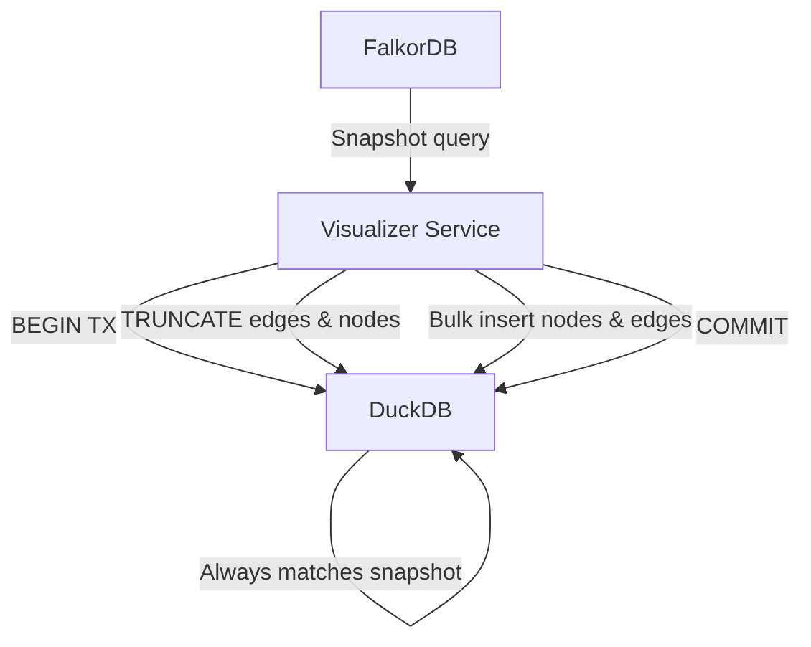
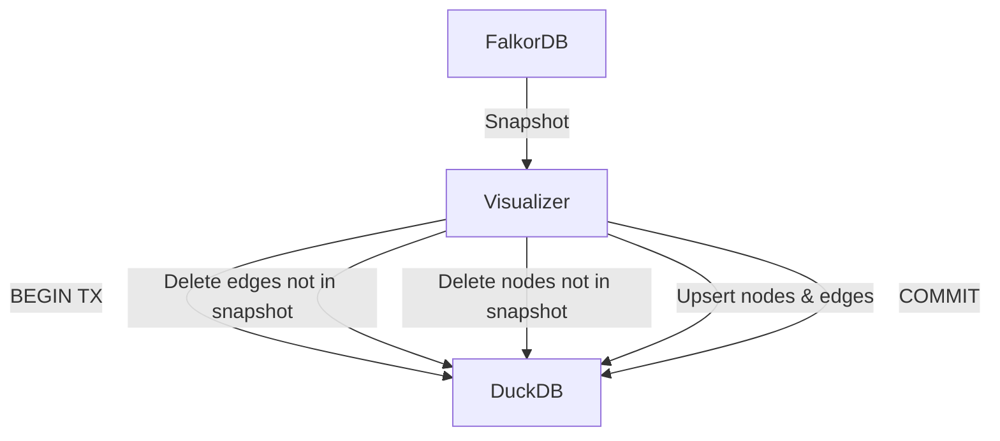

# Data Synchronization Investigation: FalkorDB → Rust Visualizer (DuckDB)

Author: Augment Agent
Date: 2025-08-28

## Summary
- Issue: When points are deleted or lost from FalkorDB, they are not removed from the Rust visualizer’s DuckDB cache, causing inconsistent views.
- Root cause: The reload path only upserts (INSERT OR REPLACE/IGNORE) and never deletes rows from DuckDB. There is no code path to apply deletions when data disappears in Falkor.
- Impact: Stale nodes/edges remain visible in the visualizer; counts and content diverge from FalkorDB after deletions.
- Recommended fix (short-term): On detected changes, perform an atomic TRUNCATE-and-reload of DuckDB tables within a single transaction to ensure parity with Falkor snapshots.
- Alternatives: Differential delete + upsert, or leverage the existing delta tracker to drive DeleteNodes/DeleteEdges operations. Long-term: adopt event-driven CDC with delete handling.

---

## **CRITICAL UPDATE: Memory Issue Discovery**

**New Finding**: The memory issue you discovered provides crucial context that significantly impacts our synchronization strategy:

### Memory Problem Analysis
- **Root Cause**: Full snapshot queries (`MATCH (n) RETURN n.uuid, n.name, properties(n)`) load all 3,446+ nodes with extensive properties simultaneously
- **Memory Explosion**: Each node has multiple properties (uuid, name, summary, centralities, created_at, etc.) causing FalkorDB to exceed its 2GB memory limit
- **Query Pattern**: The "entire_graph" query with limit 100,000 tries to load everything at once:
  ```cypher
  MATCH (n) RETURN n.uuid, n.name, properties(n) as props  // ALL nodes
  MATCH (n)-[r]->(m) WHERE n.uuid IN [...] RETURN ...     // ALL edges
  ```
- **Fragmentation**: High memory fragmentation (4.54x) wastes significant memory on internal structures

### Impact on Deletion Problem
This memory issue **compounds** the deletion synchronization problem:
1. **Failed Reloads**: Manual reloads fail due to memory exhaustion, preventing any sync (including deletions)
2. **Workaround Dependency**: Users restart the visualizer service to get fresh data, which temporarily masks the deletion problem
3. **Scale Limitation**: As the graph grows, full snapshot approaches become increasingly impossible

### Revised Solution Requirements
Any deletion sync solution must now also address memory constraints:
- **Mandatory**: Use paginated/streaming queries instead of full snapshots
- **Mandatory**: Implement incremental sync to avoid large memory allocations
- **Critical**: Handle deletions within memory-efficient patterns

---

## Current Architecture and Behavior

### Data Flow
- A background task in the Rust visualizer periodically checks FalkorDB for changes (node count, edge count, centrality sum) on a 5s interval.
- When changes are detected, the service fetches a fresh snapshot of the graph from FalkorDB and calls `DuckDBStore.load_initial_data(nodes, edges)` to reload DuckDB.

Key code paths:
- Change detection and reload trigger:
  - `graph-visualizer-rust/src/main.rs` (background loop)
  - Fetches snapshot via `execute_graph_query(...)` and then calls `load_initial_data(...)`.

### DuckDB Store Behavior
- Tables are created in-memory (`Connection::open_in_memory()`), with `nodes` and `edges` schemas and indexes.
- Reload logic:
  - Nodes: `INSERT OR REPLACE`
  - Edges: `INSERT OR IGNORE`
  - No `DELETE`, `TRUNCATE`, or anti-join cleanup is performed.
- Update queue processing supports adding/updating nodes and adding edges; deletion operations are defined in the enum but not implemented and not invoked.

### Transactions
- Insert/upsert operations run in a DuckDB transaction (`conn.transaction()` … `tx.commit()`), but without any deletion statements.

### Caches and Deltas
- After reload, in-memory caches are cleared.
- A `DeltaTracker` computes a delta (nodes_added/updated/removed, edges_added/updated/removed) and broadcasts it to clients; however, the DuckDB store itself is not pruned based on these removals.

---

## Evidence in Code (selected references)

- Change detection triggers full snapshot fetch, then reload:
  - `graph-visualizer-rust/src/main.rs` (lines ~550–600):
    - On counts/centrality change, fetch `graph_data` from FalkorDB and call `store_clone.load_initial_data(graph_data.nodes, graph_data.edges)`.

- Reload performs only inserts/upserts with no deletes:
  - `graph-visualizer-rust/src/duckdb_store.rs`:
    - Nodes: `INSERT OR REPLACE INTO nodes (...) VALUES (...)`
    - Edges: `INSERT OR IGNORE INTO edges (...) VALUES (...)`

- Deletion operations exist in type but are not processed:
  - `UpdateOperation` includes `DeleteNodes` and `DeleteEdges`, but `process_updates` has no deletion branch and no `DELETE FROM` statements.

---

## Root Cause
- The system never issues deletion statements to DuckDB during reloads or incremental updates. When FalkorDB no longer contains certain nodes/edges, the DuckDB cache retains those rows indefinitely.
- The periodic change detection sets last-known counts to the new Falkor values, but the reload does not remove stale rows, creating a persistent divergence.
- No referential constraints enforce cascading deletions on edges when nodes are removed.

---

## Best Practices and Research Findings

### Snapshot-based one-way sync
- Optionally perform TRUNCATE + bulk insert (inside a single transaction) to atomically recreate the cache from the latest snapshot.
- Alternate approach: Use temporary tables to load the snapshot, then perform anti-join deletes (remove rows not present in the temp snapshot) and upsert new/changed rows.

### Event-driven incremental sync (CDC)
- Use CDC (e.g., Debezium) to capture inserts/updates/deletes and apply them to the target store. Properly handle delete events (and tombstones in Kafka-based pipelines) to remove records downstream.
- Ensure idempotency and at-least-once semantics; handle duplicates on restart.

### Error handling and observability
- Wrap sync operations in transactions; rollback on failures.
- Emit structured logs and metrics: counts inserted/updated/deleted, duration, last_successful_sync_timestamp, failure counters.

### Performance considerations
- For full reloads: batched inserts, single transaction, consider COPY if available; maintain stable identifiers to preserve visualization layout (current design sorts UUIDs to assign deterministic `idx`).
- For differential operations: prefer anti-join deletes over large NOT IN lists; chunk operations for very large sets; ensure indexes on key columns.

---

## Solution Options

### Option A: Atomic Snapshot Replace (TRUNCATE + reload) - **REVISED**
- **Status**: ❌ **Not viable due to memory constraints**
- Original approach would still require full snapshot loading, which fails with 3,446+ nodes
- Must be replaced with paginated approach:
  1) Begin transaction
  2) TRUNCATE `edges`, TRUNCATE `nodes`
  3) **Load nodes in batches** (e.g., 500 at a time): `MATCH (n) RETURN ... SKIP {offset} LIMIT 500`
  4) **Load edges in batches** for each node batch
  5) Commit
- Pros: Still guarantees consistency, handles memory limits
- Cons: More complex than original, multiple round-trips to FalkorDB

### Option B: Snapshot-based Differential Delete + Upsert - **REVISED**
- **Status**: ⚠️ **Requires memory-efficient implementation**
- Steps:
  1) **Load snapshot in paginated batches** (not full snapshot)
  2) Build set of current node/edge IDs from batches
  3) DELETE edges not present in snapshot or referencing nodes that will be deleted
  4) DELETE nodes absent from snapshot
  5) Upsert new/updated nodes and edges in batches
- Pros: Less write volume when changes are small, memory-efficient
- Cons: Significantly more complex; requires careful batch coordination and transactional atomicity

### Option C: Delta-driven Deletions (reuse existing DeltaTracker) - **REVISED**
- **Status**: ❌ **Not viable without fixing snapshot loading**
- Current delta computation still requires full snapshot loading, which fails due to memory
- Would need to be combined with paginated loading:
  - Load data in batches, compute delta incrementally
  - Apply `DELETE FROM nodes WHERE id IN (nodes_removed)` and `DELETE FROM edges WHERE (source,target,type) IN (edges_removed)`
- Pros: Leverages existing delta logic once memory issue is solved
- Cons: Delta computation becomes complex with paginated loading; reliability concerns remain

### Option D: **NEW - Paginated Incremental Sync (Recommended)**
- **Status**: ✅ **Most viable given memory constraints**
- Approach:
  1) **Timestamp-based incremental queries**: `MATCH (n) WHERE n.updated_at > $last_sync RETURN ... LIMIT 500`
  2) **Periodic full reconciliation** using paginated batches to catch deletions
  3) **Memory-efficient deletion detection**: Compare paginated node ID sets between DuckDB and FalkorDB
- Pros: Solves both memory and deletion problems; scalable; efficient for ongoing operations
- Cons: Requires timestamp tracking in FalkorDB; more complex initial implementation

### Long-term: CDC-based Incremental Sync
- **Status**: ✅ **Ideal long-term solution**
- If FalkorDB (or the ingestion pipeline) can emit reliable change events, consume them and apply per-event upserts/deletes to DuckDB
- Handle delete events (and tombstones if using Kafka with compaction) consistently
- **Advantage**: Completely avoids memory issues by processing individual change events

---

## Error Handling, Logging, and Metrics
- Transactional guarantees: wrap delete+insert phases in one transaction; rollback on error to leave previous consistent state intact.
- Logs: source snapshot counts; rows inserted/updated/deleted; duration; reason for fallback to full rebuild (if any).
- Metrics: `last_successful_sync_timestamp`, `nodes_deleted`, `edges_deleted`, `nodes_upserted`, `edges_upserted`, sync duration histograms, failure counters.
- Health endpoints: expose last sync status/time and counts for observability.

---

## Performance Considerations
- Batch size: use prepared statements and chunked inserts to avoid large single statements.
- Index strategy: ensure indexes on `nodes.id`, `nodes.idx`, `edges` primary key columns; consider recreating or deferring index building for large full reloads if beneficial.
- Deterministic layout: preserve existing deterministic `idx` assignment by sorting UUIDs, avoiding layout jumps between reloads.

---

## Risks and Trade-offs
- Full TRUNCATE + reload may introduce transient read inconsistency if readers query mid-transaction (DuckDB transactions mitigate, but consider read isolation for concurrent reads).
- Differential deletes must be carefully ordered (delete edges referencing nodes first) to avoid violations if constraints are added later.
- Delta-driven approach depends on delta completeness; introduce periodic full sync to re-baseline.

---

## Illustrations

### Current Flow (counts-based trigger + snapshot reload without deletes)
```mermaid
flowchart TD
  A[FalkorDB] -->|Snapshot query| B[Visualizer Service]
  B -->|INSERT OR REPLACE nodes| C[DuckDB]
  B -->|INSERT OR IGNORE edges| C
  subgraph DetectedChange
    D[Counts/Centrality changed?]
  end
  D -->|Yes| A
  D -->|No| E[Wait 5s]
  E --> D
  C -.->|Stale rows remain (no DELETE)| C
```

### Proposed Option A (atomic TRUNCATE + reload)


### Proposed Option B (differential delete + upsert)


### Proposed Option C (apply delta_tracker removals)
```mermaid
flowchart TD
  A[FalkorDB] -->|Snapshot| B[Visualizer]
  B -->|Reload (upsert)| C[DuckDB]
  B -->|Compute delta| D[DeltaTracker]
  D -->|nodes_removed/edges_removed| B
  B -->|DELETE based on delta| C
```

---

## Proposed Plan

### Short-term (fix correctness quickly) - **REVISED**
1) **Immediate**: Increase FalkorDB memory limit to 4-8GB as temporary workaround
2) Implement **Option D (Paginated Incremental Sync)**:
   - Add timestamp tracking to nodes in FalkorDB if not present
   - Implement paginated queries with proper deletion detection
   - Use periodic full reconciliation (paginated) to catch missed deletions
3) Add structured logging and basic metrics around reloads
4) Validate with tests (see below)

### Medium-term (optimize writes)
1) Implement Option B or C to reduce write volume:
   - B: anti-join deletes + upserts
   - C: apply delta_tracker removals to DuckDB
2) Add feature flag to toggle between full reload and differential modes for experimentation.

### Long-term (incremental real-time updates)
1) Evaluate CDC/event stream from Falkor or the ingest layer.
2) Implement an idempotent consumer that applies inserts/updates/deletes with retries and offset tracking.

---

## Test Plan
- Unit/integration tests (against DuckDB):
  - Deletion sync: Start with nodes/edges A,B; simulate Falkor snapshot with only A; ensure B nodes and associated edges are removed after reload.
  - Mixed change set: Add new nodes/edges, update node labels, delete some nodes; verify DuckDB matches the snapshot exactly post-reload.
  - Large dataset: Measure timing and memory for full reload vs differential; ensure transaction atomicity (no partial states observed).
  - Delta-driven deletion (if adopted): feed deltas with removals and ensure DuckDB reflects them.

---

## Open Questions
- Dataset size and acceptable reload latency? This informs whether full TRUNCATE + reload is acceptable operationally.
- Is near real-time deletion propagation required (favor CDC), or is 5s polling sufficient?
- Are there external consumers relying on DuckDB stability during reloads (need read isolation strategy)?
- Do we need edge cascading deletes when nodes are removed, or should we keep explicit delete ordering?

---

## Appendix: Notable Code Locations
- Change detection + reload trigger: `graph-visualizer-rust/src/main.rs` (background monitoring task)
- DuckDB store schema and load logic: `graph-visualizer-rust/src/duckdb_store.rs`
- Delta computation and broadcasting: `graph-visualizer-rust/src/delta_tracker.rs` (imported and used in `main.rs`)


