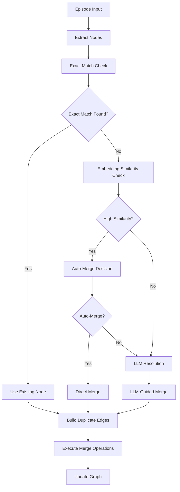

# Entity Deduplication System in Graphiti Graph Container

## Overview

The Graphiti graph container implements a sophisticated multi-layered entity deduplication system that operates at different stages of the data ingestion and maintenance pipeline. This system ensures that duplicate entities are identified, merged, and properly maintained across the knowledge graph.

## Architecture Overview

The deduplication system consists of several key components:

1. **Real-time Deduplication** - During episode addition
2. **Bulk Processing Deduplication** - For batch operations
3. **LLM-Assisted Deduplication** - For complex disambiguation
4. **Post-processing Maintenance** - For ongoing graph cleanup

## Key Components and Flow

### 1. Main Orchestration Layer

**File**: `graphiti_core/graphiti.py`

The main `Graphiti` class orchestrates the deduplication process through two primary methods:

#### Single Episode Processing (`add_episode`)

```python
# Extract nodes from episode content
extracted_nodes = await extract_nodes(...)

# Resolve and deduplicate nodes
resolved_nodes, uuid_map, node_duplicates = await resolve_extracted_nodes(
    self.clients, extracted_nodes, episode, previous_episodes, entity_types
)

# Build duplicate edges for audit trail
duplicate_of_edges: list[EntityEdge] = []
merge_operations: list[tuple[str, str]] = []

if node_duplicates:
    duplicate_of_edges, merge_operations = build_duplicate_of_edges(
        episode, now, node_duplicates
    )

# Execute merge operations after persistence
if merge_operations:
    await execute_merge_operations(self.driver, merge_operations)
```

#### Bulk Episode Processing (`add_episodes_bulk`)

```python
# Extract nodes and edges in bulk
extracted_nodes, extracted_edges = await extract_nodes_and_edges_bulk(...)

# Bulk deduplication
resolved_nodes, uuid_map = await dedupe_nodes_bulk(
    self.clients, extracted_nodes, episode_tuples, entity_types
)

# Build and execute merge operations
if node_duplicates:
    duplicate_of_edges, merge_operations = build_duplicate_of_edges(
        episodes[0], now, node_duplicates
    )
    merge_stats = await execute_merge_operations(self.driver, merge_operations)
```

### 2. Node Resolution and Deduplication

**File**: `graphiti_core/utils/maintenance/node_operations.py`

#### Primary Resolution Function

```python
async def resolve_extracted_nodes(
    clients: GraphitiClients,
    extracted_nodes: list[EntityNode],
    episode: EpisodicNode | None = None,
    previous_episodes: list[EpisodicNode] | None = None,
    entity_types: dict[str, BaseModel] | None = None,
    existing_nodes_override: list[EntityNode] | None = None,
) -> tuple[list[EntityNode], dict[str, str], list[tuple[EntityNode, EntityNode]]]:
```

**Returns**:
- `resolved_nodes`: Final list of deduplicated nodes
- `uuid_map`: Mapping from duplicate UUIDs to canonical UUIDs
- `node_duplicates`: Pairs of (duplicate_node, canonical_node) for audit trail

#### LLM-Based Deduplication

```python
async def dedupe_node_list(
    llm_client: LLMClient,
    nodes: list[EntityNode],
) -> tuple[list[EntityNode], dict[str, str]]:
    # Prepare context for LLM
    nodes_context = [
        {'uuid': node.uuid, 'name': node.name, **node.attributes} 
        for node in nodes
    ]
    
    # Use LLM to identify and merge duplicates
    llm_response = await llm_client.generate_response(
        prompt_library.dedupe_nodes.node_list(context)
    )
```

### 3. Bulk Processing Utilities

**File**: `graphiti_core/utils/bulk_utils.py`

#### Bulk Node Deduplication

```python
async def dedupe_nodes_bulk(
    clients: GraphitiClients,
    extracted_nodes: list[list[EntityNode]],
    episode_tuples: list[tuple[EpisodicNode, list[EpisodicNode]]],
    entity_types: dict[str, BaseModel] | None = None,
) -> tuple[dict[str, list[EntityNode]], dict[str, str]]:
    embedder = clients.embedder
    min_score = 0.8

    # Generate embeddings for similarity comparison
    await semaphore_gather(
        *[create_entity_node_embeddings(embedder, nodes) for nodes in extracted_nodes]
    )

    # Find similar results across episodes
    dedupe_tuples: list[tuple[list[EntityNode], list[EntityNode]]] = []
    # ... similarity detection logic
```

#### Edge Deduplication

```python
async def dedupe_edges_bulk(
    clients: GraphitiClients,
    extracted_edges: list[list[EntityEdge]],
    episode_tuples: list[tuple[EpisodicNode, list[EpisodicNode]]],
    _entities: list[EntityNode],
    edge_types: dict[str, BaseModel],
    _edge_type_map: dict[tuple[str, str], list[str]],
) -> dict[str, list[EntityEdge]]:
```

### 4. Edge Operations and Merge Management

**File**: `graphiti_core/utils/maintenance/edge_operations.py`

#### Duplicate Edge Creation

```python
def build_duplicate_of_edges(
    episode: EpisodicNode,
    created_at: datetime,
    duplicate_nodes: list[tuple[EntityNode, EntityNode]],
) -> tuple[list[EntityEdge], list[tuple[str, str]]]:
    """
    Build IS_DUPLICATE_OF edges and return merge operations.
    
    Returns:
        Tuple of (edges list, merge operations list)
        where merge operations are tuples of (canonical_uuid, duplicate_uuid)
    """
```

#### Merge Execution

```python
async def execute_merge_operations(
    driver,
    merge_operations: list[tuple[str, str]],
) -> dict[str, Any]:
    """
    Execute node merge operations to transfer edges from duplicates to canonical nodes.
    
    Returns:
        Dictionary with overall statistics from all merges
    """
```

### 5. Maintenance and Post-Processing

**File**: `maintenance_dedupe_entities.py`

This standalone script provides comprehensive post-processing deduplication capabilities:

#### Duplicate Detection

```python
async def find_duplicate_candidates(
    self,
    group_id: str = None,
    similarity_threshold: float = 0.92,
    name_similarity_threshold: float = 0.95,
) -> List[List[EntityNode]]:
    """Find groups of potentially duplicate entities based on name similarity"""
    
    query = """
    MATCH (n:Entity)
    WHERE ($group_id IS NULL OR n.group_id = $group_id)
    RETURN n.uuid as uuid, n.name as name, n.name_embedding as name_embedding,
           n.group_id as group_id, n.summary as summary, n.created_at as created_at,
           labels(n) as labels
    ORDER BY n.name
    """
```

#### Auto-Merge Logic

```python
def _should_auto_merge(
    self, duplicate_nodes: List[EntityNode], confidence_threshold: float = 0.95
) -> bool:
    """Check if all nodes in group have high enough similarity to auto-merge without LLM"""
    
    # Check name similarity after normalization
    normalized_names = [self._normalize_name(node.name) for node in duplicate_nodes]
    
    # Auto-merge if high confidence based on name and embedding similarity
    return True  # if conditions met
```

#### Merge Execution

```python
async def merge_duplicate_group(
    self, duplicate_nodes: List[EntityNode]
) -> Tuple[EntityNode, Dict[str, str]]:
    """Merge a group of duplicate nodes using LLM-based deduplication or auto-merge"""
    
    if self._should_auto_merge(duplicate_nodes):
        # Auto-merge high-confidence duplicates
        # Sort by creation date to keep oldest as primary
        sorted_nodes = sorted(duplicate_nodes, key=lambda n: n.created_at or '')
        primary_node = sorted_nodes[0]
    else:
        # Use LLM for ambiguous cases
        resolved_nodes, uuid_map = await dedupe_node_list(self.llm_client, duplicate_nodes)
        primary_node = resolved_nodes[0] if resolved_nodes else duplicate_nodes[0]
    
    # Update edges and delete duplicates
    await self._update_edges_for_merged_nodes(primary_node.uuid, uuid_map)
    await self._delete_duplicate_nodes(primary_node.uuid, uuid_map)
```

## Deduplication Strategies

### 1. Exact Matching
- Direct name comparison
- UUID-based identification
- Fast, deterministic resolution

### 2. Embedding-Based Similarity
- Uses semantic embeddings for entity names
- Configurable similarity thresholds (typically 0.8-0.95)
- Handles variations in naming

### 3. LLM-Assisted Resolution
- For complex or ambiguous cases
- Considers entity attributes and context
- Provides intelligent merging decisions

### 4. Auto-Merge Criteria
- High name similarity (>95%)
- Strong embedding similarity
- Consistent entity attributes
- Bypasses LLM for efficiency

## Data Flow



## Configuration and Thresholds

### Similarity Thresholds
- **Embedding Similarity**: 0.8 (bulk), 0.92 (maintenance)
- **Name Similarity**: 0.95 (auto-merge threshold)
- **Confidence Threshold**: 0.95 (auto-merge decision)

### Processing Modes
- **Real-time**: During episode addition
- **Batch**: Bulk episode processing
- **Maintenance**: Post-processing cleanup

## Performance Considerations

### Optimization Strategies
1. **Early Exact Matching**: Avoid expensive operations when possible
2. **Embedding Caching**: Reuse computed embeddings
3. **Batch Processing**: Group similar operations
4. **Auto-Merge**: Skip LLM for high-confidence cases
5. **Parallel Processing**: Use semaphore-controlled concurrency

### Monitoring and Metrics
- Merge operation statistics
- Processing duration tracking
- Duplicate detection rates
- LLM usage optimization

## Integration Points

### Core Graphiti Methods
- `add_episode()`: Single episode with real-time deduplication
- `add_episodes_bulk()`: Batch processing with bulk deduplication

### Utility Functions
- `resolve_extracted_nodes()`: Primary resolution logic
- `dedupe_nodes_bulk()`: Bulk processing utilities
- `dedupe_node_list()`: LLM-assisted deduplication

### Maintenance Tools
- `maintenance_dedupe_entities.py`: Standalone cleanup script
- `run_deduplication.py`: Execution wrapper

## Error Handling and Recovery

### Failure Modes
- LLM service unavailability
- Embedding generation failures
- Database transaction conflicts
- Memory constraints during bulk processing

### Recovery Strategies
- Graceful degradation to exact matching
- Retry mechanisms with exponential backoff
- Transaction rollback and cleanup
- Partial processing with error reporting

## Future Enhancements

### Planned Improvements
1. **Incremental Learning**: Improve deduplication accuracy over time
2. **User Feedback Integration**: Allow manual override and learning
3. **Advanced Similarity Metrics**: Multi-modal similarity assessment
4. **Real-time Monitoring**: Dashboard for deduplication metrics
5. **Performance Optimization**: Further reduce LLM dependency

### Extensibility Points
- Custom similarity functions
- Pluggable deduplication strategies
- Domain-specific entity types
- Integration with external knowledge bases

## File Reference Summary

### Core Implementation Files
- `graphiti_core/graphiti.py` - Main orchestration
- `graphiti_core/utils/maintenance/node_operations.py` - Node resolution and LLM deduplication
- `graphiti_core/utils/bulk_utils.py` - Bulk processing utilities
- `graphiti_core/utils/maintenance/edge_operations.py` - Edge management and merge operations

### Maintenance Scripts
- `maintenance_dedupe_entities.py` - Standalone deduplication script
- `run_deduplication.py` - Execution wrapper

### Documentation
- `docs/graph-build-deduplication-and-merge.md` - Detailed technical documentation
- `docs/merge-implementation-proposed-changes.md` - Implementation proposals

## Conclusion

The Graphiti entity deduplication system provides a comprehensive, multi-layered approach to maintaining graph consistency and preventing entity proliferation. Through a combination of exact matching, embedding-based similarity, and LLM-assisted resolution, the system ensures high-quality entity management while maintaining performance and scalability.
